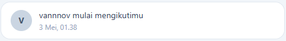

# Nexus Social App

A social media web application built with React, Vite, Tailwind CSS, and Supabase.

## Screenshots

> Add your screenshots here

| Home Feed | Profile Page |
|---|---|
|  |  |

| Create Post | Notifications |
|---|---|
|  |  |

## Features

- **Authentication** — Register & login with email/password via Supabase Auth
- **Create Post** — Upload photos with captions
- **Like & Comment** — Like and comment on posts
- **Profile Page** — View user profiles with posts, followers, and following count
- **Edit Profile** — Update username and bio
- **Follow/Unfollow** — Follow other users
- **Notifications** — Get notified on likes, comments, and follows
- **Protected Routes** — Pages only accessible when logged in

## Tech Stack

- **Frontend** — React + Vite
- **Styling** — Tailwind CSS
- **Backend & Database** — Supabase (PostgreSQL)
- **Authentication** — Supabase Auth
- **Storage** — Supabase Storage
- **Routing** — React Router DOM
- **Icons** — React Icons

## Database Schema

```
auth.users
    ├── profiles    (1 user → 1 profile)
    ├── posts       (1 user → many posts)
    ├── likes       (1 user → many likes, 1 like per post)
    ├── comments    (1 user → many comments)
    ├── follows     (1 user → many follows)
    └── notifications
```

## Getting Started

### Prerequisites

- Node.js
- Supabase account

### Installation

1. Clone the repository

```bash
git clone https://github.com/NoufalZidan/nexus-social-app.git
cd nexus-social-app
```

2. Install dependencies

```bash
npm install
```

3. Create `.env` file in the root directory

```env
VITE_SUPABASE_URL=your_supabase_url
VITE_SUPABASE_ANON_KEY=your_supabase_anon_key
```

4. Run the development server

```bash
npm run dev
```

## Project Structure

```
src/
├── components/
│   ├── Navbar.jsx
│   ├── PostCard.jsx
│   ├── CreatePost.jsx
│   ├── EditProfile.jsx
│   └── ProtectedRoute.jsx
├── pages/
│   ├── Home.jsx
│   ├── Profile.jsx
│   ├── Notifications.jsx
│   ├── Register.jsx
│   └── Login.jsx
└── lib/
    └── supabase.js
```

## License

This project is open source and available under the [MIT License](LICENSE).